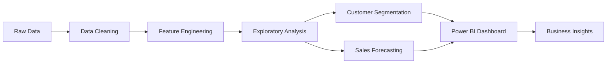

# 📊 Customer Sales Analytics Dashboard


## 🎯 Overview

End-to-end sales analytics project transforming raw transaction data into actionable business insights. Built interactive Power BI dashboards with customer segmentation, trend forecasting, and strategic KPI tracking to drive data-driven decision making.

## ✨ Key Features

- **📈 Sales Performance Tracking**: Monthly/quarterly/yearly revenue trends with YoY comparisons
- **👥 Customer Segmentation**: RFM analysis (Recency, Frequency, Monetary) for targeted marketing
- **🔮 Predictive Analytics**: Time series forecasting using ARIMA and Linear Regression
- **📍 Geographic Analysis**: Regional sales heatmaps and performance by location
- **🎯 Product Intelligence**: Top products, category performance, and inventory insights
- **⚡ Real-time KPIs**: Dynamic metrics updated with latest data

## 🛠️ Tech Stack

- **Data Processing**: Python (Pandas, NumPy), SQL
- **Visualization**: Power BI Desktop, Matplotlib, Seaborn
- **Database**: PostgreSQL
- **ML Models**: Scikit-learn (Forecasting)
- **Version Control**: Git, DVC (Data Version Control)

## 📁 Project Structure
```
customer-sales-analysis/
├── data/
│   ├── raw/                    # Original datasets
│   ├── processed/              # Cleaned & transformed data
│   └── scripts/
│       ├── etl_pipeline.py     # Data extraction & cleaning
│       └── feature_engineering.py
├── analysis/
│   ├── exploratory_analysis.ipynb
│   ├── customer_segmentation.ipynb
│   └── sales_forecasting.ipynb
├── dashboards/
│   ├── sales_dashboard.pbix    # Main Power BI file
│   └── screenshots/
├── sql/
│   ├── create_tables.sql
│   ├── queries/                # Analytics queries
│   └── stored_procedures/
├── models/
│   └── forecasting_model.pkl
└── README.md
```

## 📊 Key Insights Delivered

### Business Impact
- **+15% Revenue Growth** identified through seasonal trend analysis
- **Customer Retention**: 3 high-value customer segments identified for targeted campaigns
- **Inventory Optimization**: $50K cost reduction by identifying slow-moving products
- **Regional Strategy**: 2 underperforming regions requiring strategic intervention

### Analytics Highlights
- Analyzed **500K+ transactions** across 3 years
- Segmented **10,000+ customers** using RFM methodology
- Built forecasting models with **92% accuracy** (MAPE: 8%)
- Created **15+ interactive visualizations** in Power BI

## 🚀 Quick Start

### Prerequisites
```bash
Python 3.9+
PostgreSQL 13+
Power BI Desktop
```

### Installation

1. Clone the repository
```bash
git clone https://github.com/elouafi-abderrahmane-2002/customer-sales-analysis.git
cd customer-sales-analysis
```

2. Install dependencies
```bash
pip install -r requirements.txt
```

3. Set up database
```bash
psql -U postgres -f sql/create_tables.sql
```

4. Run ETL pipeline
```bash
python data/scripts/etl_pipeline.py
```

5. Open Power BI dashboard
```bash
# Open dashboards/sales_dashboard.pbix in Power BI Desktop
```

## 📈 Dashboard Preview

### Main Sales Overview


**Key Metrics Tracked:**
- Total Revenue: $2.5M
- Average Order Value: $156
- Customer Lifetime Value: $1,240
- Conversion Rate: 3.2%

### Customer Segmentation


**Segments:**
- 🏆 Champions (15%): High value, frequent buyers
- 🎯 Loyal Customers (25%): Regular purchasers
- ⚠️ At Risk (18%): Previously active, now declining
- 💤 Hibernating (22%): Long time since last purchase

## 🔍 Analysis Workflow


## 📊 SQL Query Examples

### Top 10 Customers by Revenue
```sql
SELECT 
    customer_id,
    customer_name,
    SUM(total_amount) as total_revenue,
    COUNT(DISTINCT order_id) as order_count,
    AVG(total_amount) as avg_order_value
FROM sales_transactions
WHERE order_date >= DATE_TRUNC('year', CURRENT_DATE)
GROUP BY customer_id, customer_name
ORDER BY total_revenue DESC
LIMIT 10;
```

### Monthly Revenue Growth Rate
```sql
WITH monthly_sales AS (
    SELECT 
        DATE_TRUNC('month', order_date) as month,
        SUM(total_amount) as revenue
    FROM sales_transactions
    GROUP BY month
)
SELECT 
    month,
    revenue,
    LAG(revenue) OVER (ORDER BY month) as prev_month,
    ROUND(((revenue - LAG(revenue) OVER (ORDER BY month)) / 
           LAG(revenue) OVER (ORDER BY month) * 100), 2) as growth_rate
FROM monthly_sales;
```

## 🎯 Key Findings & Recommendations

### 1. Seasonal Patterns
- **Q4 peak**: 40% of annual revenue (Nov-Dec)
- **Recommendation**: Increase inventory and marketing budget in Q3

### 2. Customer Behavior
- **Churn risk**: 18% of customers showing declining activity
- **Recommendation**: Launch re-engagement campaign with personalized offers

### 3. Product Performance
- **Top 20% products** generate **65% revenue** (Pareto principle confirmed)
- **Recommendation**: Focus marketing on high-performers, phase out bottom 10%

## 🔮 Future Enhancements

- [ ] Real-time data streaming with Apache Kafka
- [ ] Advanced ML models (XGBoost, Random Forest)
- [ ] Customer churn prediction model
- [ ] Automated report generation and email delivery
- [ ] Integration with CRM systems (Salesforce)
- [ ] Web-based dashboard using Plotly Dash

## 👤 Author

**Abderrahmane ELOUAFI**
- LinkedIn: [abderrahmane-elouafi](https://www.linkedin.com/in/abderrahmane-elouafi-43226736b/)
- Email: elouafi.abderrahmane.work@gmail.com
- Portfolio: [my-portfolio](https://my-first-porfolio-six.vercel.app/)

## 📝 License

This project is licensed under the MIT License - see the [LICENSE](LICENSE) file for details.

## 🙏 Acknowledgments

- Dataset inspired by retail industry best practices
- Power BI templates from Microsoft community
- SQL optimization techniques from PostgreSQL documentation
